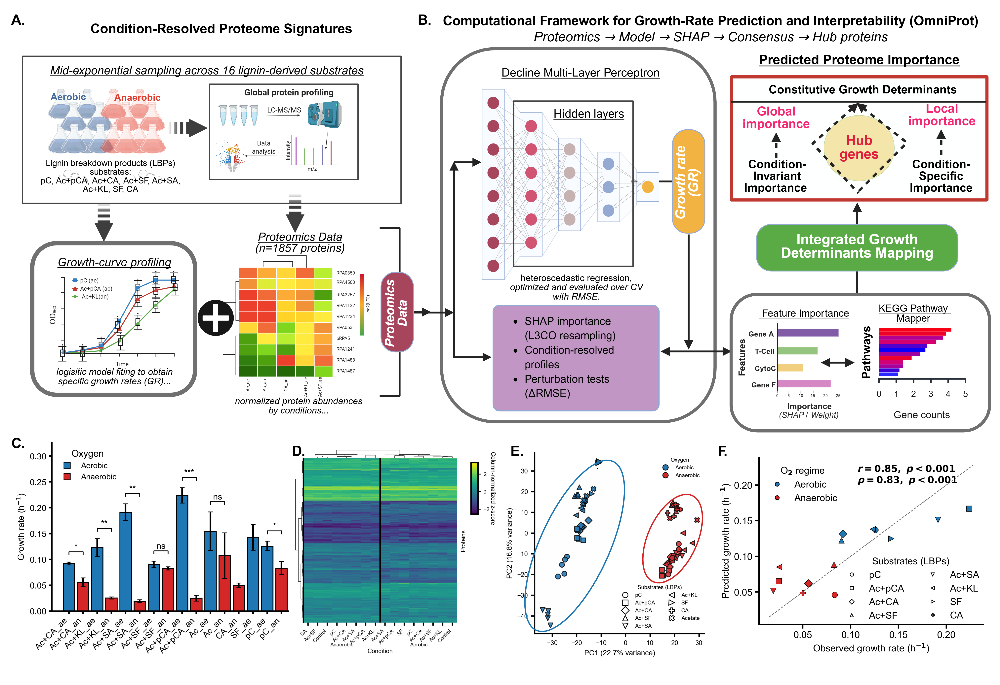

# OmniProt
### Proteome-Encoded Growth Prediction Framework for **Rhodopseudomonas palustris** CGA009

OmniProt is a full analytical framework that integrates label-free quantitative proteomics with machine-learning–based prediction to identify mechanistic drivers of microbial growth under diverse lignin-derived substrate conditions.

This repository supports the manuscript:
**“Machine Learning Resolves Proteome-Encoded Growth Predictors of *Rhodopseudomonas palustris* CGA009 on Lignin Aromatics.”**

---

## 🌐 Overview

Microbial lignin catabolism requires extensive metabolic flexibility, yet the quantitative proteomic determinants of growth remain unknown. OmniProt tests whether microbial growth outcomes across 16 substrate × oxygen conditions can be predicted directly from proteome composition—and whether feature importance can resolve core vs. adaptive biological drivers.


The framework provides:

- End-to-end neural growth prediction
- Leave-one-condition-out benchmarking
- Monte-Carlo SHAP feature attribution
- Dependence-aware hierarchical clustering
- Redundancy removal + tiered determinant mapping
- Automated figure generation for publication

## 🧬 Determinant Discovery Framework


---

## 📁 Repository Layout

```
OmniProt/
│
├── data/                     # Input datasets
│   ├── proteomics_data.xlsx
│   ├── GR_comparison.csv
│   ├── kegg_mapper_result.txt
│   ├── Kegg2Accession_pathway.xlsx
│   └── arial.ttf
│
├── growth_curve_fits/        # Growth model fits
│
├── results/                  # Generated after pipeline execution
│   └── data/
│
├── figures/                  # Created by analysis notebooks
│
├── run_pipeline_1.py         # Full ML + SHAP execution pipeline
├── functions_repo.py         # Function library + utilities
├── Analyze_Results_and_PlotFigures.ipynb
├── HyperParameterTuning.ipynb
├── OmniProt.yml              # Conda environment specification
│
└── submit_batch_job.sh       # SLURM template for HPC execution
```

---

## 📊 Input Data Summary

| File | Description |
|------|------------|
| `proteomics_data.xlsx` | LFQ abundance matrix and metadata |
| `GR_comparison.csv` | Growth rates across all experimental conditions |
| `kegg_mapper_result.txt` | KEGG annotation mapping for *R. palustris* |
| `Kegg2Accession_pathway.xlsx` | UniProt ↔ KEGG pathway associations |
| `arial.ttf` | Font file enabling journal-grade plotting |

---

## 🔄 Workflow Logic

```
Proteomics data  →  ML fitting  →  SHAP inference  →  Tier structure
```

Key stages include:

1. Model training across 16 substrate–oxygen states
2. Leave-one-condition-out validation
3. Monte-Carlo SHAP attribution
4. Dependence correction + clustering
5. Core vs. adaptive determinant identification
6. Export of figures and interpretation tables

---

## 🚀 Quick Start (Local Execution)

### Create the environment:

```bash
conda env create -f OmniProt.yml
conda activate OmniProt
```

### Run the full pipeline:

```bash
python run_pipeline_1.py
```

This completes:

- model training
- validation
- SHAP computation
- tiered determinant inference
- result export

Final output files appear in:

```
results/
results/data/
figures/
```

---

## 📈 Figure Generation

To build manuscript-ready figures:

```bash
python Analyze_Results_and_PlotFigures.py
```

This exports:

- PCA plots
- determinant tier barplots
- KEGG pathway summaries
- comparison plots across conditions

All figures are exported to:

```
figures/
```

---

## 🖥️ HPC Execution (SLURM)

The repository includes a cluster-ready run template:

```bash
sbatch submit_batch_job.sh
```

Default request:

- 2 × V100 GPUs
- 20 CPU tasks
- 60 GB RAM
- 7-day limit

This configuration matches runtime (~24–48 hr on full dataset).

---

## ⚙️ Key Dependencies

Major modules (specified in `OmniProt.yml`):

- Python ≥ 3.10
- PyTorch
- scikit-learn
- pandas / numpy / scipy
- shap
- matplotlib
- optuna

---

## 📌 Outputs of Interest

| Output File | Interpretation |
|------------|---------------|
| `output.xlsx` | Growth predictions + validation metrics |
| `SHAP_importance_mc_*.xlsx` | Monte-Carlo feature ranks |
| `cluster_members_PR_*.xlsx` | Redundancy-corrected determinants |
| `figures/` | Final visualizations |

---

## 🧪 OmniProt enables:

- proteome-level growth prediction
- mechanistic interpretation
- unbiased feature discovery
- scalable proteomics ML pipelines

This framework generalizes to microbial systems beyond *R. palustris*.

---

## 📄 License

MIT License—academic use.

---

## 📬 Contact

**Abraham Osinuga**
University of Nebraska–Lincoln
Email: aosinuga2@huskers.unl.edu
